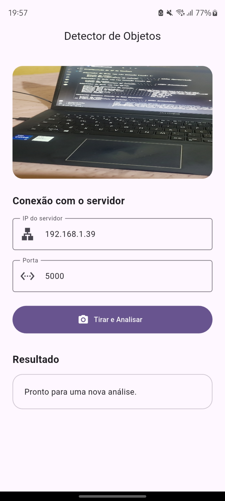
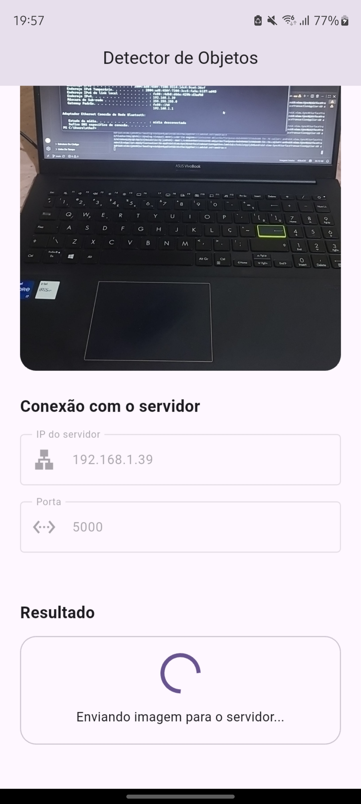
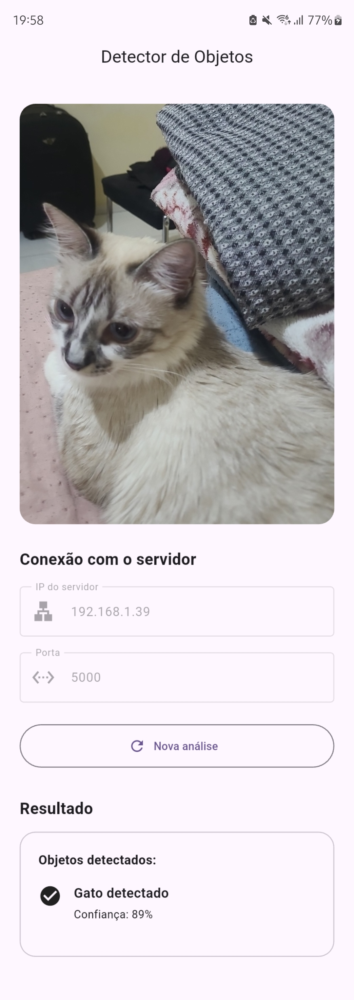
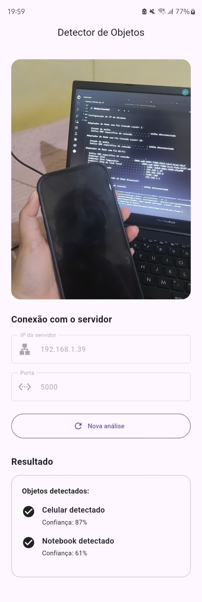
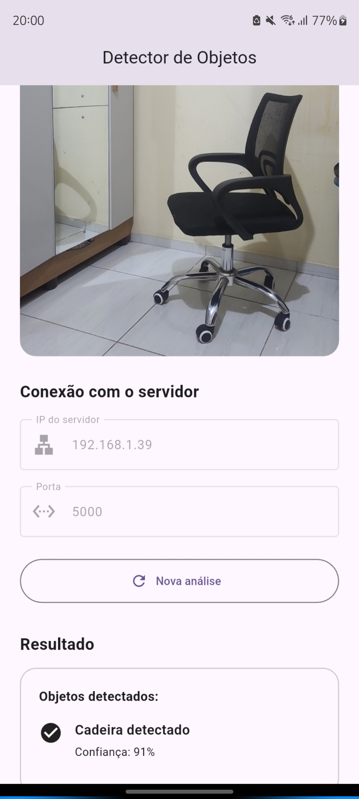

# Atividade 2 — Foto via Botão

## Android → Servidor Python por Socket TCP

Projeto desenvolvido para a Atividade 2 da disciplina de Sistemas Distribuídos.

O sistema é composto por:

- um aplicativo Android desenvolvido em **Flutter/Dart**;
- um servidor desenvolvido em **Python**;
- comunicação entre cliente e servidor utilizando **Socket TCP**;
- processamento das imagens utilizando **OpenCV** e **YOLOv8n**.

O aplicativo captura uma fotografia utilizando a câmera do celular, redimensiona e comprime a imagem em JPEG, envia a fotografia ao servidor e exibe os objetos identificados pelo modelo de detecção.

---

## Funcionamento

O fluxo da aplicação é:

```text
Celular Android
      │
      │ Captura da foto
      ▼
Aplicativo Flutter
      │
      │ JPEG (~80%, largura máxima de 1280 px)
      │ Socket TCP
      ▼
Servidor Python
      │
      │ OpenCV + YOLOv8n
      ▼
Detecção de objetos
      │
      │ JSON
      ▼
Aplicativo Flutter
      │
      ▼
Resultado da análise
```

Exemplos de resultados apresentados no aplicativo:

```text
Pessoa detectada
Confiança: 87%

Cadeira detectada
Confiança: 72%
```

Caso nenhum objeto seja identificado:

```text
Nada Detectado
```

---

# Tecnologias utilizadas

## Aplicativo Android

- **Flutter**
- **Dart**
- pacote `camera`
- pacote `image`
- biblioteca nativa `dart:io`

### Responsabilidades do aplicativo

- acesso à câmera do celular;
- captura da fotografia;
- redimensionamento da imagem;
- compressão JPEG com qualidade aproximada de 80%;
- largura máxima de 1280 px;
- comunicação TCP com o servidor;
- envio da fotografia;
- recebimento da resposta;
- exibição dos objetos detectados;
- tratamento de erros de conexão.

---

## Servidor

- **Python 3.11**
- **Socket TCP**
- **OpenCV**
- **NumPy**
- **Ultralytics**
- **YOLOv8n**
- **PyTorch**

### Responsabilidades do servidor

- aguardar conexões TCP;
- receber a fotografia;
- reconstruir a imagem recebida;
- salvar a imagem com timestamp;
- executar a detecção utilizando YOLOv8n;
- obter nome e confiança das detecções;
- retornar o resultado para o aplicativo.

---

# Modelo de detecção

O modelo utilizado é:

```text
YOLOv8n
```

O YOLOv8n é a versão Nano da família YOLOv8 e foi escolhido por possuir baixo custo computacional e permitir a execução da detecção em CPU.

O modelo utilizado é pré-treinado e consegue identificar diversas classes de objetos, como:

- pessoa;
- cadeira;
- mochila;
- carro;
- bicicleta;
- cachorro;
- gato;
- garrafa;
- celular;
- entre outros.

O arquivo `yolov8n.pt` não precisa ser armazenado no repositório. Na primeira execução, a biblioteca Ultralytics pode realizar o download do modelo automaticamente.

---

# Estrutura do projeto

```text
Sistemas_Distribu-dos_T2/
│
├── app/
│   ├── android/
│   │
│   ├── lib/
│   │   ├── main.dart
│   │   │
│   │   ├── models/
│   │   │   ├── detection.dart
│   │   │   └── detection_response.dart
│   │   │
│   │   ├── screens/
│   │   │   └── home_screen.dart
│   │   │
│   │   └── services/
│   │       ├── camera_service.dart
│   │       ├── image_service.dart
│   │       └── socket_service.dart
│   │
│   └── pubspec.yaml
│
├── server/
│   ├── server.py
│   ├── detector.py
│   ├── requirements.txt
│   └── received_images/
│
├── screenshots/
│   ├── app.png
│   ├── captured_image.jpg
│   └── detection_result.png
│
└── README.md
```

---

# Protocolo de comunicação

A comunicação entre Flutter e Python utiliza **Socket TCP**.

A porta padrão utilizada pelo projeto é:

```text
5000
```

Cada fotografia é processada utilizando uma nova conexão TCP.

## Flutter → Python

O envio da fotografia possui o seguinte formato:

```text
┌─────────────────────────┬──────────────────────────┐
│ 4 bytes                 │ N bytes                  │
│ tamanho da imagem       │ imagem JPEG              │
│ uint32 / big-endian     │                          │
└─────────────────────────┴──────────────────────────┘
```

Primeiro são enviados **4 bytes contendo o tamanho da imagem**.

Em seguida são enviados todos os bytes da fotografia JPEG.

---

## Python → Flutter

A resposta utiliza:

```text
┌─────────────────────────┬──────────────────────────┐
│ 4 bytes                 │ N bytes                  │
│ tamanho da resposta     │ JSON UTF-8               │
│ uint32 / big-endian     │                          │
└─────────────────────────┴──────────────────────────┘
```

Exemplo de resposta:

```json
{
  "success": true,
  "objects": [
    {
      "name": "person",
      "confidence": 0.87
    },
    {
      "name": "chair",
      "confidence": 0.72
    }
  ],
  "error": null
}
```

Caso nenhum objeto seja encontrado:

```json
{
  "success": true,
  "objects": [],
  "error": null
}
```

Caso ocorra erro:

```json
{
  "success": false,
  "objects": [],
  "error": "mensagem do erro"
}
```

Após enviar a resposta, a conexão é encerrada.

Para uma nova fotografia, o aplicativo cria uma nova conexão TCP.

---

# Pré-requisitos

## Servidor

É recomendado utilizar:

```text
Python 3.11
```

No Windows também pode ser necessário instalar o **Microsoft Visual C++ Redistributable x64**, utilizado por dependências como o PyTorch.

## Aplicativo

É necessário possuir:

- Flutter instalado;
- Android SDK;
- celular Android ou emulador;
- depuração USB habilitada caso seja utilizado um celular físico.

Para verificar o ambiente Flutter:

```bash
flutter doctor
```

---

# Como executar o servidor

## 1. Acessar a pasta

No Windows PowerShell:

```powershell
cd server
```

## 2. Criar o ambiente virtual

```powershell
py -3.11 -m venv .venv
```

## 3. Instalar as dependências

```powershell
.\.venv\Scripts\python.exe -m pip install --upgrade pip
```

```powershell
.\.venv\Scripts\python.exe -m pip install -r requirements.txt
```

Para a versão utilizada durante o desenvolvimento, o PyTorch pode ser instalado com:

```powershell
.\.venv\Scripts\python.exe -m pip install `
  torch==2.5.1 `
  torchvision==0.20.1 `
  torchaudio==2.5.1 `
  --index-url https://download.pytorch.org/whl/cpu
```

## 4. Iniciar o servidor

```powershell
.\.venv\Scripts\python.exe server.py
```

Quando estiver funcionando, o terminal exibirá:

```text
Servidor TCP iniciado e escutando em 0.0.0.0:5000
Aguardando imagem...
```

O terminal deve permanecer aberto enquanto o aplicativo estiver sendo utilizado.

---

# Como configurar IP e porta

O celular precisa conseguir acessar o computador onde o servidor Python está sendo executado.

Durante os testes, o celular e o computador devem estar conectados à **mesma rede Wi-Fi**.

## Descobrir o IP no Windows

Execute:

```powershell
ipconfig
```

Procure:

```text
Adaptador de Rede sem Fio Wi-Fi
```

e localize:

```text
Endereço IPv4
```

Exemplo:

```text
192.168.1.35
```

No aplicativo configure:

```text
IP do servidor: 192.168.1.35
Porta: 5000
```

> O endereço IP pode mudar ao trocar de rede ou reconectar o computador ao roteador.

Não utilize no aplicativo:

```text
127.0.0.1
localhost
0.0.0.0
```

Também devem ser evitados endereços pertencentes a redes virtuais, como interfaces Docker.

O servidor utiliza:

```text
0.0.0.0:5000
```

para aceitar conexões pelas interfaces de rede disponíveis, enquanto o aplicativo deve utilizar o **IPv4 real do computador**.

---

# Como executar o aplicativo Flutter

## 1. Acessar a pasta do aplicativo

Na raiz do projeto:

```powershell
cd app
```

### Instalar as dependências

O servidor foi desenvolvido e testado com **Python 3.11**.

```powershell
py -3.11 -m venv .venv
.\.venv\Scripts\python.exe -m pip install --upgrade pip
.\.venv\Scripts\python.exe -m pip install -r requirements.txt

## 3. Verificar o celular conectado

Com a depuração USB habilitada:

```powershell
flutter devices
```

Exemplo:

```text
SM G780G (mobile) • RX8R40APLAR • android-arm64 • Android 13
```

## 4. Executar

```powershell
flutter run
```

Também é possível informar diretamente o ID do aparelho:

```powershell
flutter run -d ID_DO_DISPOSITIVO
```

---

# Como utilizar

Com o servidor Python em execução:

1. Abra o aplicativo no celular.
2. Informe o **IP do computador**.
3. Mantenha a porta `5000`.
4. Posicione a câmera em direção aos objetos.
5. Toque em **Tirar e Analisar**.
6. A fotografia capturada será exibida na tela.
7. Aguarde o processamento pelo servidor.
8. Confira os objetos identificados e suas respectivas confianças.
9. Toque em **Nova análise** para tirar outra fotografia.

---

# Salvamento das imagens

Cada fotografia recebida é salva pelo servidor com um timestamp.

Exemplo:

```text
server/received_images/
├── 2026-09-09_15-30-12.jpg
├── 2026-09-09_15-31-45.jpg
└── 2026-09-09_15-33-07.jpg
```

Isso permite armazenar diferentes análises sem sobrescrever fotografias anteriores.

---

# Capturas de tela

## Aplicativo Android


## Imagem capturada


## Resultado da detecção


---

# Roteiro de demonstração

1. Iniciar o servidor Python.

```powershell
.\server\.venv\Scripts\python.exe .\server\server.py
```

2. Confirmar no terminal:

```text
Aguardando imagem...
```

3. Abrir o aplicativo Android.

4. Informar o IP do computador e a porta `5000`.

5. Apontar a câmera para uma cena contendo objetos.

6. Tocar em:

```text
Tirar e Analisar
```

7. O aplicativo captura e envia a fotografia.

8. O servidor recebe a imagem, salva com timestamp e executa a detecção com YOLOv8n.

9. O aplicativo exibe os objetos encontrados.

Exemplo:

```text
Pessoa detectada
Confiança: 87%
```

10. Realizar uma nova análise utilizando o botão:

```text
Nova análise
```

11. Demonstrar também o caso em que nenhum objeto é encontrado:

```text
Nada Detectado
```

---

# Tratamento de erros

O aplicativo possui tratamento para situações como:

- IP inválido;
- porta inválida;
- servidor desligado;
- falha de conexão;
- timeout;
- resposta incompleta;
- JSON inválido;
- erro retornado pelo servidor.

Exemplo:

```text
Não foi possível conectar ao servidor.
Verifique o IP, a porta e se o servidor está ligado.
```

---

# Divisão da dupla

| Pessoa | Responsabilidade |
|---|---|
| **Pessoa 1** | Aplicativo Flutter, câmera, processamento da imagem, cliente TCP e interface |
| **Pessoa 2** | Servidor Python, Socket TCP, OpenCV, YOLO e detecção |
| **Ambos** | Integração, testes, documentação e demonstração |

---

# Resultado

O projeto implementa a comunicação distribuída entre um aplicativo Android e um servidor Python utilizando **Sockets TCP**.

O aplicativo é responsável pela captura e envio da fotografia, enquanto o servidor realiza o processamento utilizando **YOLOv8n + OpenCV** e devolve ao aplicativo os objetos identificados.

---

## Demonstração da Aplicação

### 1. Interface inicial

A aplicação apresenta uma interface para captura da imagem, configuração do servidor e visualização dos resultados.

O usuário informa:
- Endereço IP do servidor;
- Porta de comunicação TCP;
- Captura da imagem através da câmera.



---

### 2. Captura e envio da imagem

Após pressionar o botão **"Tirar e Analisar"**, a imagem é capturada, convertida para JPEG e enviada ao servidor através de uma conexão TCP.

Durante o processamento, a aplicação informa o envio da imagem.



---

### 3. Detecção dos objetos

Após o processamento no servidor utilizando YOLO, o resultado retorna para o aplicativo contendo:

- Nome do objeto detectado;
- Percentual de confiança da detecção.

Exemplo:







---

### 4. Exemplos de detecção

Alguns testes realizados:

| Objeto | Confiança |
|---|---|
| Gato | 89% |
| Celular | 87% |
| Notebook | 61% |
| Cadeira | 91% |

---

## Fluxo da aplicação

```text
Câmera Flutter
      |
      v
Captura da imagem
      |
      v
Conversão JPEG
      |
      v
Envio TCP para servidor
      |
      v
Servidor Python + YOLO
      |
      v
Resposta JSON
      |
      v
Atualização da interface Flutter